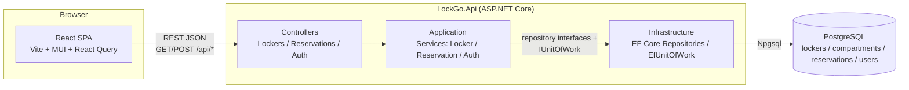
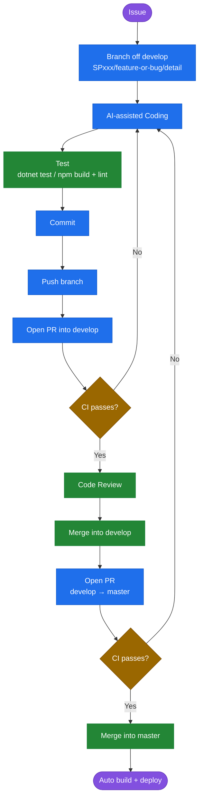

# LockGo — Find & Reserve Locker

Smart Locker platform (mock company: LockGo). A **Find & Reserve Locker**
feature — search, view detail, reserve, confirm — built as a technical
assessment, with account sign-up/sign-in as a bonus feature.

```
Search Locker → View Detail → Reserve → Confirmation
```

## Contents

1. [Project Overview](#1-project-overview)
2. [Architecture](#2-architecture)
3. [Technology](#3-technology)
4. [Installation](#4-installation)
5. [Configuration](#5-configuration)
6. [Database Setup](#6-database-setup)
7. [Run Application](#7-run-application)
8. [Run Test](#8-run-test)
9. [API Documentation](#9-api-documentation)
10. [AI Tools ที่ใช้](#10-ai-tools-ที่ใช้)
11. [Git Workflow](#git-workflow)

Deep-dive references, all in [`deliverables/`](deliverables/) (also the
assessment submission folder — see its
[`README.md`](deliverables/README.md) for the full checklist mapping):
[`ARCHITECTURE.md`](deliverables/ARCHITECTURE.md) (full diagram + the
concurrency-critical reservation path), [`DATABASE.md`](deliverables/DATABASE.md)
(ERD, column/index reference, migrations), [`API.md`](deliverables/API.md)
(complete request/response shapes), [`TESTING.md`](deliverables/TESTING.md)
(what's covered, how to run, live-DB verification),
[`AI-WORKFLOW.md`](deliverables/AI-WORKFLOW.md) (the build process as a
diagram), [`AI-PROMPTS.md`](deliverables/AI-PROMPTS.md) (the prompts used
to drive the build, and the goal behind each),
[`AI-CODE-REVIEW.md`](deliverables/AI-CODE-REVIEW.md) (a review of the
AI-written booking flow — in Thai),
[`DEPLOYMENT.md`](deliverables/DEPLOYMENT.md) (Docker images, GitHub
Actions CD to an existing server, DuckDNS + Caddy).

---

## 1. Project Overview

LockGo lets a user find a nearby smart locker, see what compartment sizes
it has free, and reserve one for a chosen duration — the classic
search → detail → reserve → confirm flow, plus optional account sign-up/
sign-in.

**Core flow**

1. **Find Locker** — search by name/address text, by distance from the
   browser's own geolocation (opt-in, toggleable), filter by compartment
   size and/or "available only". Each result shows a per-size breakdown
   (e.g. *S: 2 left · M: none · L: 1 left*), not just one combined count.
2. **Locker Detail** — full address, operating status, and the same
   per-size availability, gated so a size can only be selected once its
   `availableCount > 0`.
3. **Reservation** — pick a duration, see the price, confirm. The Confirm
   button is protected against duplicate submissions from a rapid
   double-click (see [§2](#2-architecture)).
4. **Confirmation** — booking number, locker, compartment size, start/
   expiry time, status. The URL is a permalink (`/reservations/{bookingNumber}`) so
   it survives a refresh or gets shared.

**Bonus**: account sign-up and sign-in issue a JWT, stored client-side.
Reservations don't require being signed in yet — every booking is still
attributed to a single mock user by design. Wiring real users into
reservations would have meant changing the booking flow, its tests, and the
seeded data all at once; keeping auth additive means the token is genuinely
issued and validated today, and gating endpoints later is a self-contained
change rather than a half-finished one shipped early.

**Data model at a glance**: `Locker` 1—N `Compartment` (several
compartments can share the same size — e.g. 3× Small — so "how many are
free" is a real count, not just a status flag), `Compartment` 1—N
`Reservation`, `User` 1—N `Reservation`.

---

## 2. Architecture



**Layering** (dependencies point inward — `Domain` has zero dependencies;
`Application` depends only on `Domain`, never on EF Core, so its business
rules are unit-testable with plain fakes/mocks):

```
LockGo.Api/            Controllers, Program.cs, DI wiring, error middleware
LockGo.Application/    Services (business rules), DTOs, repository interfaces
LockGo.Domain/         Entities, enums
LockGo.Infrastructure/ EF Core DbContext, migrations, repository implementations
LockGo.Tests/          xUnit: unit, concurrency, integration
```

**The concurrency-critical path — `POST /api/reservations`.** This is the
one place correctness under concurrent requests actually matters
(spec's business rule: no duplicate reservations from a double-clicked
Confirm button). Inside one DB transaction:

1. Look up the reservation by `idempotencyKey` — if found, return it
   (makes a resent/duplicated request safe).
2. Confirm the locker is open, then find a free compartment of the
   requested size for the requested window, checking overlap against
   **live `Reservation` rows**, never the denormalized `Status` column
   (which exists purely so list/search reads stay cheap).
3. Insert the reservation, flip that compartment to `Occupied`.
4. Two independent DB-level safety nets on commit: a **unique index on
   `idempotency_key`** catches a genuine double-click racing past step 1,
   and **`xmin`-based optimistic concurrency** on `Compartment` catches two
   *different* requests racing for the same compartment. Both get
   translated from raw Postgres/EF exceptions into the right HTTP status
   in `EfUnitOfWork`.

Optimistic (`xmin`) concurrency was used instead of a pessimistic row lock
because the target database is a low-spec free-tier instance — a lock held
for a transaction's duration blocks other connections on a server that
can't spare many of them; an optimistic check only costs something on the
rare occasion two writes actually collide. Full mechanics, plus a real bug
this design surfaced during test-writing, in
[`deliverables/ARCHITECTURE.md`](deliverables/ARCHITECTURE.md).

**Availability model.** `Compartment.Status` is denormalized (fast reads
only, never trusted on the write path). Multiple compartments can share a
size at one locker, so availability is always a **count**
(`availableCount`/`totalCount` per size), not a boolean. Reservation
expiry is lazy — `Status` is only ever `Active`/`Completed`/`Cancelled`;
whether a reservation currently counts as active is derived
(`Status == Active && EndTime > Now`) rather than swept by a background job.

**Auth.** Sign-up/sign-in issue a JWT (`Microsoft.AspNetCore.Authentication.JwtBearer`
validates it server-side); passwords are hashed with BCrypt. No endpoint
currently requires `[Authorize]` — this makes the token real and ready to
gate endpoints later without it being decorative today.

---

## 3. Technology

| Layer | Choice | Why |
|---|---|---|
| Frontend | React 19 + Vite + TypeScript + MUI 7 | Fast dev loop, typed end-to-end, MUI covers the form-heavy screens (filters, selectors, summaries) without hand-rolling components |
| Frontend data | TanStack Query 5 + Axios | Caching/retry/loading-state handling for server data without hand-rolled `useEffect` fetching |
| Frontend routing | React Router 7 | Standard SPA routing; also carries locker/compartment selection between pages via router state |
| Backend | .NET 10 (latest LTS) + ASP.NET Core Web API | Strong typing, first-class EF Core support |
| ORM | EF Core 10 + Npgsql + EFCore.NamingConventions | Migrations give a clear, reviewable DB schema history; naming-convention package maps C# PascalCase to Postgres snake_case automatically |
| Auth | `Microsoft.AspNetCore.Authentication.JwtBearer`, `System.IdentityModel.Tokens.Jwt`, `BCrypt.Net-Next` | Standard JWT bearer validation; BCrypt for password hashing (industry-standard, salted, slow-by-design) |
| Database | PostgreSQL | Specified — already provisioned on a free-tier server, hence the low-connection-pool, index-conscious design throughout |
| API docs | Swashbuckle (Swagger/OpenAPI) | Interactive docs for free from the existing controller/DTO annotations |
| Backend testing | xUnit, Moq, FluentAssertions **7.x**, `Microsoft.AspNetCore.Mvc.Testing`, EF Core InMemory | FluentAssertions pinned below 8.x deliberately — v8+ moved to a commercial license, 7.x is the last MIT-licensed release |
| CI/CD | GitHub Actions, Docker, GHCR, Caddy | No self-hosted agent needed, unlike Jenkins — the target server can't spare RAM for one (it was literally running Jenkins for an earlier project; retiring that was part of this move). Full pipeline: test → build+push images to GHCR → SSH deploy → Caddy reverse-proxies both containers with automatic Let's Encrypt TLS. See [`deliverables/DEPLOYMENT.md`](deliverables/DEPLOYMENT.md) |

MUI is pinned to **7.3.11** rather than the newest `9.x` tag — `9.3.1`'s
type definitions broke `Stack`/`Typography` prop typing under current
TypeScript in a way that failed the build. `7.3.11` is the latest *stable*
major release.

### Project structure

```
LockGo.Api/              .NET solution
  LockGo.Api/             Controllers, Program.cs, DI, error middleware
  LockGo.Application/     Services, DTOs, repository interfaces
  LockGo.Domain/          Entities, enums
  LockGo.Infrastructure/  EF Core DbContext, migrations, repositories
  LockGo.Tests/           xUnit: unit, concurrency, integration
frontend/                 React + Vite + TS + MUI
deliverables/              Assessment submission docs — see below
deploy/                   Compose files (direct-IP + domain mode) and Caddyfile
.github/workflows/        CI (build + test, both projects)
```

---

## 4. Installation

**Prerequisites**

- [.NET 10 SDK](https://dotnet.microsoft.com/download)
- [Node.js 22+](https://nodejs.org/)
- A PostgreSQL database (local, Docker, or a hosted instance — Neon,
  Supabase, RDS, etc. all work) — this project targets a free-tier server,
  so keep the connection pool small if you provision your own
- `dotnet-ef` tool: `dotnet tool install --global dotnet-ef`

**Clone and restore**

```bash
git clone <this-repo-url> LockGo
cd LockGo

# Backend
cd LockGo.Api
dotnet restore

# Frontend
cd ../frontend
npm install
```

Nothing else needs installing — no Docker Compose, no message queue, no
cache layer; the feature set doesn't need one, and every extra moving part
is one more thing competing for RAM on the target free-tier server.

---

## 5. Configuration

Backend configuration lives in `LockGo.Api/LockGo.Api/appsettings.json`
(committed, no secrets) and `appsettings.Development.json` (gitignored —
copy it from the tracked `.example` file, see [§6](#6-database-setup)).

```json
{
  "AllowedOrigins": ["http://localhost:5173"],
  "Database": {
    "Host": "localhost",
    "Port": 5432,
    "Database": "lockgo",
    "Username": "lockgo",
    "Password": "CHANGE_ME",
    "MaximumPoolSize": 10,
    "SslMode": "Require"
  },
  "Jwt": {
    "Secret": "CHANGE_ME_TO_A_LONG_RANDOM_VALUE_AT_LEAST_32_BYTES"
  }
}
```

| Section | Field | Notes |
|---|---|---|
| — | `AllowedOrigins` | CORS allow-list for the frontend origin(s) |
| `Database` | `Host`/`Port`/`Database`/`Username`/`Password` | Built into one Npgsql connection string via `NpgsqlConnectionStringBuilder` in `LockGo.Infrastructure.DependencyInjection` — structured fields instead of one raw ADO.NET string, so individual values are easy to override per environment |
| `Database` | `MaximumPoolSize` | Kept small (10) deliberately for the free-tier target server |
| `Database` | `SslMode` | `Require` for hosted Postgres (Neon, Supabase, RDS, ...); `Disable` for a local instance without TLS |
| `Jwt` | `Secret` | Symmetric signing key for issued tokens. Has an insecure built-in default so the app and tests start without any local config — **override it** for anything beyond throwaway local dev |
| `Jwt` | `Issuer`/`Audience`/`ExpiryMinutes` | Optional overrides; default to `"LockGo"`/`"LockGo"`/7 days |

Frontend configuration is a single `.env` (gitignored — copy from
`frontend/.env.example`):

```
VITE_API_BASE_URL=http://localhost:5117/api
```

---

## 6. Database Setup

Schema reference (ERD, column/index detail, migrations):
[`deliverables/DATABASE.md`](deliverables/DATABASE.md).

1. Create a database (any name — `lockgo` is used below).
2. Copy `LockGo.Api/LockGo.Api/appsettings.Development.json.example` to
   `appsettings.Development.json` and fill in the `Database` (and
   optionally `Jwt`) section with real values — **never commit this
   file**, it's gitignored specifically because it ends up holding real
   credentials.
3. Apply migrations. The app does this automatically on startup outside
   the `Testing` environment (see `Program.cs`), or run it manually:

   ```bash
   cd LockGo.Api
   dotnet ef database update --project LockGo.Infrastructure --startup-project LockGo.Api
   ```

   Three migrations exist: `InitialCreate` (lockers/compartments/
   reservations/users), `AddUserAuthFields` (email/username/password
   hash columns for sign-up/sign-in), and `SwitchToSequentialIntIds`
   (uuid keys → sequential integers).

   ⚠️ **`SwitchToSequentialIntIds` drops and recreates all four tables** —
   Postgres cannot cast `uuid` to `integer`, so the columns can't be altered
   in place. Seed lockers/compartments come back on the next startup;
   reservations and registered accounts do not. See
   [`deliverables/DATABASE.md`](deliverables/DATABASE.md#migrations).

4. Seed data is inserted automatically on startup — **idempotent per
   locker** (matched by name, not an all-or-nothing gate), so re-running
   it against a database that already has some of the seed lockers (or
   real reservations made against them) only adds what's missing rather
   than duplicating or wiping anything. Currently seeds a mock user plus
   **10 lockers** around Bangkok with deliberately uneven inventory —
   some offer all three sizes, some are missing one entirely (e.g. one
   location offers Small only), so the "this location doesn't have that
   size at all" UI path has real data to exercise, not just "offers it
   but full."

---

## 7. Run Application

**Backend**

```bash
cd LockGo.Api
dotnet run --project LockGo.Api --launch-profile http
```

- API: `http://localhost:5117`
- Swagger UI: `http://localhost:5117/swagger` (Development only)

**Frontend**

```bash
cd frontend
cp .env.example .env   # adjust VITE_API_BASE_URL if the API isn't on :5117
npm install
npm run dev
```

Opens on `http://localhost:5173`. The backend's CORS policy allows this
origin by default (`AllowedOrigins` in `appsettings.json`).

---

## 8. Run Test

Full test documentation (what's covered per class, live-DB verification):
[`deliverables/TESTING.md`](deliverables/TESTING.md).

**Backend**

```bash
cd LockGo.Api
dotnet test
```

60 tests, three kinds:

- **Unit** — `ReservationService`'s and `LockerService`'s business rules
  (reserve success / no-availability / double-booking prevention /
  idempotent replay / per-size availability), plus `AuthService`
  (sign-up validation, duplicate email/username, sign-in success/failure).
- **Concurrency** — a dedicated suite proving a double-clicked Confirm
  button can't create two reservations, *and* that two concurrent requests
  for the same size correctly consume two separate compartments rather
  than colliding on one. This needed a hand-rolled fake with real thread
  synchronization rather than a mock: the first version passed for the
  wrong reason, because the fake resolved synchronously and the two
  "concurrent" calls never actually raced. See
  [`deliverables/TESTING.md`](deliverables/TESTING.md) for the full story.
- **Integration** — HTTP-level tests via `WebApplicationFactory` (an
  in-memory test server + EF Core's InMemory provider), covering the
  lockers/reservations/auth endpoints end to end through real routing,
  model binding, and middleware.

**Frontend**

```bash
cd frontend
npm run lint
npm run build   # also type-checks (tsc -b)
```

There's no frontend unit-test runner configured (no Vitest/Jest) — `lint`
+ `build`'s type-check are what CI enforces. Feature-level verification
was done by driving the running app in a real browser (see the
live-database note below) rather than automated frontend tests.

**Verified against a live database.** The full flow (search → detail →
reserve → confirm, including firing genuinely concurrent double-click
requests) has been run against a real hosted Postgres instance (Neon), not
just the test suite's InMemory provider. That pass caught two real bugs
that every automated test had missed — an `EnableRetryOnFailure`/
manual-transaction conflict that made every reservation fail with a 500,
and a `size`+`availability` filter combination bug — both fixed and now
covered by tests. Full story in
[`deliverables/TESTING.md`](deliverables/TESTING.md#verified-against-a-live-database).

Not yet done: `EXPLAIN ANALYZE` against a realistic data volume (the seed
data is only a handful of rows per locker).

---

## 9. API Documentation

Base URL (local dev): `http://localhost:5117/api`. Interactive Swagger UI:
`http://localhost:5117/swagger`. Full request/response shapes and error
tables: [`deliverables/API.md`](deliverables/API.md) — summary below.

All error responses share one shape:

```json
{ "error": { "code": "SOME_CODE", "message": "Human-readable explanation." } }
```

### Auth

| Method | Path | Description |
|---|---|---|
| `POST` | `/api/auth/signup` | Create an account. Auto-signs in — response carries a JWT, same shape as `/signin`. `409` on duplicate email/username. |
| `POST` | `/api/auth/signin` | `{ username, password }` → JWT + user profile. `401` for either a wrong username or wrong password (deliberately indistinguishable, so the error can't be used to enumerate valid usernames). |

No endpoint currently requires the token — see [§2](#2-architecture) for
why.

### Lockers

| Method | Path | Description |
|---|---|---|
| `GET` | `/api/lockers` | Search/filter. Query params: `location` (`"lat,lng"`), `distance` (km, needs `location`), `size` (`S`\|`M`\|`L`), `availability` (bool), `search` (free text on name/address), `startTime` + `durationHours` (report availability for a future slot instead of "right now"). |
| `GET` | `/api/lockers/{id}` | Detail, including the same per-size availability breakdown (`sizeAvailability: [{ size, price, availableCount, totalCount }]`) and `isFullyBooked`. Accepts the same `startTime`/`durationHours` pair. |

### Reservations

| Method | Path | Description |
|---|---|---|
| `POST` | `/api/reservations` | Books a **locker + size** (not a specific compartment — the server assigns a free one of that size inside the transaction). Body: `{ lockerId, size, durationHours, idempotencyKey, startTime }`. Idempotent on `idempotencyKey` — safe to retry, including a double-clicked Confirm resending the same request. |
| `GET` | `/api/reservations/{bookingNumber}` | Fetch a booking by its booking number — what the confirmation screen polls. Keyed on the random booking number rather than the sequential `id`, so the shareable permalink can't be walked to read other people's bookings. |

**Error reference**

| HTTP status | When |
|---|---|
| 400 | Invalid request body/query params |
| 401 | Sign-in failed (bad credentials) |
| 404 | Locker, size, or reservation not found |
| 409 | Locker closed, requested size fully booked, or duplicate email/username on sign-up |
| 500 | Unhandled server error — no stack trace is ever returned to the client |

---

## 10. AI Tools ที่ใช้

This project was built with **Claude Code** running **Claude Sonnet 5**, in
an agentic session working from a written project spec rather than
turn-by-turn chat — most of the implementation was self-directed by the AI
through sub-goals, with the human reviewing results and steering at
decision points rather than dictating every step.

Full breakdown across three documents:

- [`deliverables/AI-PROMPTS.md`](deliverables/AI-PROMPTS.md) — the actual
  prompt sequence used, and the goal behind each one.
- [`deliverables/AI-WORKFLOW.md`](deliverables/AI-WORKFLOW.md) — the build
  process as a diagram, plus what was human-decided (spec: tech stack,
  business rules, the double-click-safety mechanism) versus AI-decided
  (concrete architecture, the specific EF Core mechanics for an API that
  changed underneath the spec's description, the whole test suite's design).
- [`deliverables/AI-CODE-REVIEW.md`](deliverables/AI-CODE-REVIEW.md) — a
  review of AI-written code (in Thai), tracing the booking flow from screen
  to service against correctness / bugs / security / performance /
  maintainability. It reports a bug the 60-test suite can't catch: the
  idempotency key is fixed when the page opens while the booking details
  stay editable, so retrying after a lost response returns the original
  reservation instead of the one the user just asked for.

Worth calling out here specifically: two real, non-staged incidents came
out of this process rather than being hidden —

- A concurrency test that initially **passed for the wrong reason** (the
  fake it raced against resolved synchronously, so nothing was actually
  racing) — caught by deliberately disabling the fix and confirming the
  test still passed, which it shouldn't have.
- Two **real bugs found only once a live Postgres instance became
  available** mid-project — every automated test, including the
  integration suite, had missed both, because the InMemory test provider
  doesn't implement the code paths involved.

Both are documented in [`deliverables/TESTING.md`](deliverables/TESTING.md).

---

## Git workflow



🟣 จุดเริ่ม/จุดจบ 　　 🔵 ลงมือทำ 　　 🟢 ตรวจ/รวมงาน 　　 🟡 ประตูที่ต้องผ่าน (CI)

Two long-lived branches:

- **`develop`** — the default branch (what a fresh clone/PR points to).
  Day-to-day work lands here first.
- **`master`** — the release branch. Every push here builds both Docker
  images and deploys them automatically (see
  [`deliverables/DEPLOYMENT.md`](deliverables/DEPLOYMENT.md)) — merging to `master` is a
  real release, not just a commit.

**Flow for a unit of work:**

1. Branch off `develop`, named `SP<sprintNumber>/<feature|bug>/<short-detail>`
   (e.g. `SP003/feature/advance-booking`, `SP003/bug/reservation-timeout`).
2. Push the branch and open a PR into `develop`. CI
   (`.github/workflows/ci.yml`) runs the backend + frontend test jobs on
   the PR — merge once it's green and reviewed.
3. Once `develop` has accumulated a release's worth of work and has been
   tested, open a PR from `develop` into `master`. CI runs again on that
   PR; merging it triggers the real deploy.

**No separate staging server**: `develop` only ever runs the test jobs
(build, lint, `dotnet test`) — the `build-and-push`/`deploy` jobs are
gated to `github.ref == 'refs/heads/master' && github.event_name ==
'push'`, so pushing or merging into `develop` never builds images or
touches the VM. One server, serving `master` only; promote to a real
staging environment later if the team/infra grows.

This project's actual history predates this model — it started as one
continuous AI-assisted build session on `master` directly (see
[§10](#10-ai-tools-ที่ใช้)), verified with `dotnet test`/`npm run
build`/`npm run lint` before each commit. The two-branch flow above is
what's used from here on.
