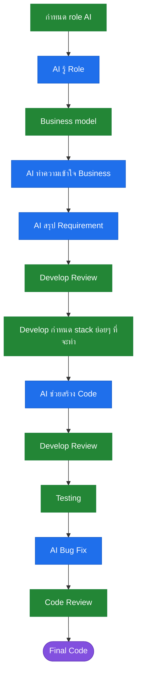

# AI Workflow

🔵 AI ทำ 　　 🟢 Develop ตัดสินใจ 　　 🟣 ผลลัพธ์

## ขั้นตอนไหน AI ทำ ขั้นตอนไหนคนตัดสินใจ

| # | ขั้นตอน | ใครทำ | รายละเอียด |
|---|---|---|---|
| 1 | กำหนด role AI | 🟢 Develop | บอก AI ว่าต้องสวมบทบาทอะไร ก่อนเริ่มงานจริง |
| 2 | AI รู้ Role | 🔵 AI | AI รับบทบาทและขอบเขตงานของตัวเอง |
| 3 | Business model | 🟢 Develop | ส่งเอกสาร business ให้ AI พร้อมเปิดให้ถามกลับถ้าสงสัย |
| 4 | AI ทำความเข้าใจ Business | 🔵 AI | อ่าน สรุป และถามกลับในจุดที่ยังไม่ชัด |
| 5 | AI สรุป Requirement | 🔵 AI | เรียบเรียง requirement จากเอกสาร business ที่ได้รับ |
| 6 | Develop Review | 🟢 Develop | ตรวจ requirement ที่ AI สรุปมา ก่อนปล่อยให้ลงมือ |
| 7 | กำหนด stack ย่อยๆ ที่จะทำ | 🟢 Develop | เลือก tech stack และแบ่งงานเป็นก้อนย่อย |
| 8 | AI ช่วยสร้าง Code | 🔵 AI | เขียน code ตาม stack และขอบเขตที่กำหนดให้ |
| 9 | Develop Review | 🟢 Develop | ตรวจ code ที่ AI เขียน ก่อนเอาไปทดสอบ |
| 10 | Testing | 🟢 Develop | รัน test และทดสอบการใช้งานจริง |
| 11 | AI Bug Fix | 🔵 AI | แก้บั๊กที่เจอจากการทดสอบ |
| 12 | Code Review | 🟢 Develop | ตรวจครั้งสุดท้าย ทั้งความถูกต้อง security performance และการดูแลต่อ |
| 13 | Final Code | — | code ที่ผ่านการตรวจแล้ว พร้อมส่ง |
