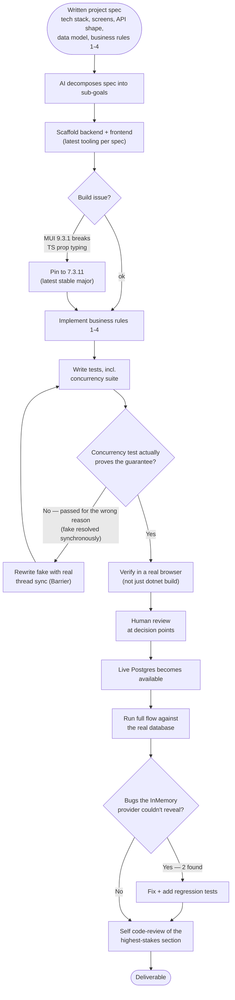

# AI Workflow

How this project was actually built: one continuous agentic session with
Claude Code (Claude Sonnet 5), working from a written project spec rather
than turn-by-turn chat. The AI decomposed the spec into sub-goals and
executed them self-directed; the human reviewed results and steered at
decision points rather than dictating every step.

> **Scope note:** this document covers the *workflow* only. The actual
> prompt text and the standalone AI-generated-code review are separate
> deliverable items, tracked but not included here yet.

## Human-decided vs. AI-decided

**Human-decided (in the spec):** feature scope and user flow; exact tech
stack; the data model and field names; all four business rules, including
the specific mechanism mandated for rule 4 (idempotency key + optimistic
concurrency, not pessimistic locking); the hybrid availability model; the
error-shape contract; the testing bar ("prove double-click doesn't
duplicate"); the deliverables checklist itself.

**AI-decided (this session):** the concrete Clean-Architecture layering
and repository/`IUnitOfWork` abstractions; the specific EF Core mechanics
for mapping `xmin`; translating Postgres exceptions into the app's HTTP
error shape; the entire test suite's design, including the hand-rolled
concurrency fake; every line of application/UI code; dependency version
choices; this documentation set.

Full narrative — the two real bugs the live-database pass caught, and the
concurrency test that initially passed for the wrong reason — in
[`AI_USAGE.md`](AI_USAGE.md) and [`DEBUGGING.md`](DEBUGGING.md).
