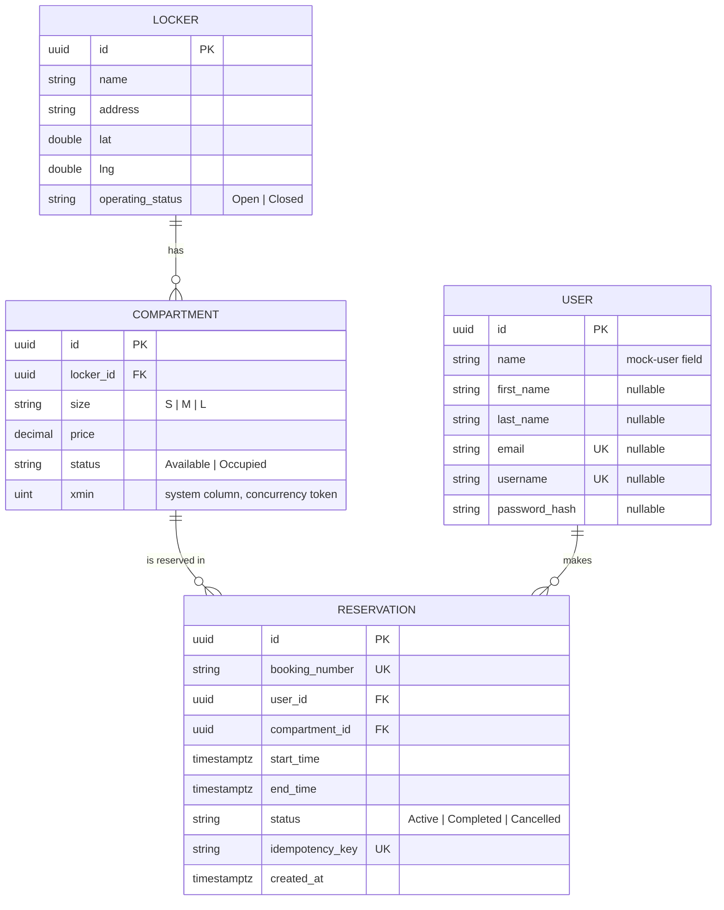

# Database Schema

PostgreSQL, mapped via EF Core (`EFCore.NamingConventions` translates C#
PascalCase to Postgres snake_case automatically — entities below are shown
with their C# names; actual columns are snake_case, e.g. `Locker.Name` →
`lockers.name`).

## ERD



`Locker` 1—N `Compartment` (several compartments can share a size — e.g.
3× Small — so availability is a count, not a flag). `Compartment` 1—N
`Reservation`. `User` 1—N `Reservation`, though nothing currently reads
that link on the write path — see [`ARCHITECTURE.md`](ARCHITECTURE.md#auth)
for why `MockUser` is still what every reservation is attributed to.

## Tables

### `lockers`

| Column | Type | Nullable | Notes |
|---|---|---|---|
| `id` | `uuid` | No | PK |
| `name` | `varchar(200)` | No | |
| `address` | `varchar(500)` | No | |
| `lat` / `lng` | `double precision` | No | |
| `operating_status` | `varchar(20)` | No | Stored as string (`Open`/`Closed`), not an int enum — readable directly in the DB |

### `compartments`

| Column | Type | Nullable | Notes |
|---|---|---|---|
| `id` | `uuid` | No | PK |
| `locker_id` | `uuid` | No | FK → `lockers.id`, `ON DELETE CASCADE` |
| `size` | `varchar(1)` | No | `S` / `M` / `L` |
| `price` | `numeric(10,2)` | No | |
| `status` | `varchar(20)` | No | `Available` / `Occupied` — **denormalized fast-read flag only**, never trusted on the write path (see [`ARCHITECTURE.md`](ARCHITECTURE.md#availability-model)) |
| `xmin` | `xid` (system column) | — | Mapped as a shadow property (`IsRowVersion()`), reused as the optimistic-concurrency token instead of a hand-rolled `RowVersion` column |

### `reservations`

| Column | Type | Nullable | Notes |
|---|---|---|---|
| `id` | `uuid` | No | PK |
| `booking_number` | `varchar(32)` | No | Human-readable reference (e.g. `LG-20260814-AB3F`), unique |
| `user_id` | `uuid` | No | FK → `users.id`, `ON DELETE RESTRICT` |
| `compartment_id` | `uuid` | No | FK → `compartments.id`, `ON DELETE RESTRICT` |
| `start_time` / `end_time` | `timestamptz` | No | |
| `status` | `varchar(20)` | No | `Active` / `Completed` / `Cancelled` — no `Expired` state; whether a reservation is currently active is derived (`Status == Active && EndTime > Now`), never swept by a background job |
| `idempotency_key` | `varchar(64)` | No | Client-generated, unique — makes `POST /api/reservations` safe to retry (double-click, network resend) |
| `created_at` | `timestamptz` | No | |

### `users`

| Column | Type | Nullable | Notes |
|---|---|---|---|
| `id` | `uuid` | No | PK |
| `name` | `varchar(200)` | No | Original mock-user field — the single hardcoded row every reservation is attributed to today |
| `first_name` / `last_name` | `varchar(100)` | Yes | Real-account fields, unset on the mock-user row |
| `email` | `varchar(320)` | Yes | Real-account field, unique |
| `username` | `varchar(50)` | Yes | Real-account field, unique |
| `password_hash` | `varchar(200)` | Yes | BCrypt hash |

A row is either "the mock user" (`name` only) or "a real account"
(everything else set) — never a mix. See
[`ARCHITECTURE.md`](ARCHITECTURE.md#auth).

## Indexes and why

| Index | Table | Type | Reason |
|---|---|---|---|
| `ix_lockers_operating_status` | `lockers` | Non-unique | Supports the search/list filter; distance filtering happens in application code (lat/lng aren't indexed — no PostGIS, out of scope for the current feature set) |
| `ix_compartments_locker_id_size_status` | `compartments` | Composite, non-unique | `GET /api/lockers?size=&availability=` filters/joins on exactly these three columns without scanning `reservations` |
| `ix_reservations_booking_number` | `reservations` | Unique | Booking numbers are user-facing lookup keys (confirmation screen, "find my booking") |
| `ix_reservations_idempotency_key` | `reservations` | Unique | The actual mutual-exclusion mechanism for "no duplicate reservation from a double-click" — a genuine race past the in-transaction check still gets caught here as a `23505` constraint violation, which `EfUnitOfWork` translates into "return the other request's reservation" |
| `ix_reservations_compartment_id_status_start_time_end_time` | `reservations` | Composite, non-unique | The booking write path's overlap check (`WHERE compartment_id = X AND status = Active AND start_time < @end AND end_time > @start`) would otherwise be a sequential scan on every reservation attempt |
| `ix_users_email`, `ix_users_username` | `users` | Unique | Sign-up duplicate checks; Postgres unique indexes allow unlimited `NULL`s, so the mock-user row (which leaves both unset) never collides with itself or a real account |
| `xmin` (system column, not a created index) | `compartments` | Concurrency token | Optimistic concurrency instead of a pessimistic row lock — see [`ARCHITECTURE.md`](ARCHITECTURE.md#the-concurrency-critical-path-post-apireservations) for why (a lock held for a transaction's duration is too expensive on a free-tier server with few spare connections) |

## Migrations

Two migrations exist, both under
[`LockGo.Infrastructure/Persistence/Migrations`](../LockGo.Api/LockGo.Infrastructure/Persistence/Migrations):

1. **`InitialCreate`** (`20260814095943`) — `lockers`, `compartments`,
   `reservations`, `users` (mock-user fields only), all indexes above
   except the two on `email`/`username`.
2. **`AddUserAuthFields`** (`20260814190944`) — adds `first_name`,
   `last_name`, `email`, `username`, `password_hash` to `users`, plus the
   unique indexes on `email`/`username`. Additive only — no data loss for
   existing rows, which simply get `NULL` in the new columns.

### Running migrations

The app applies migrations automatically on startup outside the
`Testing` environment (`Program.cs`), so in normal use nothing manual is
needed. To run them by hand instead (e.g. before first deploy, or to
inspect what SQL would run):

```bash
cd LockGo.Api
dotnet tool install --global dotnet-ef   # once
dotnet ef database update --project LockGo.Infrastructure --startup-project LockGo.Api
```

To add a new migration after changing an entity/configuration:

```bash
dotnet ef migrations add <Name> --project LockGo.Infrastructure --startup-project LockGo.Api
```

Seed data (10 lockers, mock user) is applied separately, also on startup,
idempotently per-locker — see [`ARCHITECTURE.md`](ARCHITECTURE.md) and
`DbSeeder.cs`.
