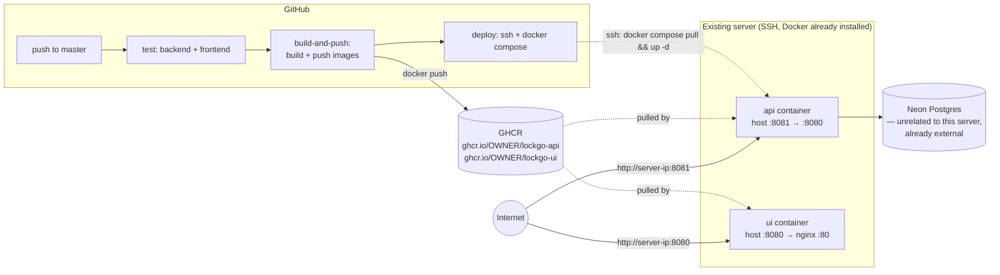

# Deployment

Docker images built and pushed by GitHub Actions, deployed onto an
existing server (not a fresh cloud service) over SSH. Two modes,
switchable without touching the Dockerfiles or the CI pipeline:

- **Direct-IP (default)** — reachable at `http://<server-ip>:8080` (UI)
  and `http://<server-ip>:8081` (API) the moment the stack starts. No
  domain, no DNS, no TLS. This is what `deploy/docker-compose.yml` runs.
- **Domain** — a real hostname in front of a Caddy reverse proxy with
  automatic Let's Encrypt TLS. This is `deploy/docker-compose.domain.yml`
  — an upgrade you opt into once a domain is actually pointed at the
  server, not a separate deployment.

Chosen over Jenkins deliberately — the assessment spec calls this out
explicitly ("Jenkins would need a self-hosted agent, which the free-tier
server can't spare RAM for"), and this server already has that exact
problem: it was running Jenkins for an earlier project. Retiring Jenkins
and using GitHub-hosted runners frees that RAM instead of adding to it.



(Domain mode replaces the two direct connections above with one through
Caddy on :80/:443 — see below.)

## Image build notes

- **API image** (`LockGo.Api/Dockerfile`) is environment-agnostic —
  `Database`/`Jwt`/`AllowedOrigins` are read from environment variables at
  **container runtime** (ASP.NET Core's config binder maps
  `Database__Host`, `Jwt__Secret`, etc. onto the same `DatabaseOptions`/
  `JwtOptions` classes already used locally — no code changes). The same
  image works for direct-IP or domain mode; only the `.env` passed to it
  changes.
- **UI image** (`frontend/Dockerfile`) is **not** environment-agnostic —
  Vite bakes `VITE_API_BASE_URL` in at build time, so the image is
  specific to whichever API URL it was built against. That value comes
  from the `VITE_API_BASE_URL` **GitHub Actions repository variable**
  (Settings → Secrets and variables → Actions → *Variables* tab — not
  *Secrets*, it isn't sensitive), not a hardcoded value in the workflow —
  update the variable (`http://<server-ip>:8081/api` → later
  `https://<api-domain>/api`) and the next push rebuilds against the new
  target with zero workflow edits. If a second concurrent environment
  (e.g. staging) is ever needed, switch to a runtime-config-injection
  pattern instead (a small `config.js` written by an entrypoint script
  from env vars, loaded before the app bundle) rather than building a
  separate image per environment.

## One-time server setup (direct-IP mode)

Run once, over SSH, before the first automated deploy:

1. **Retire Jenkins** — `systemctl stop jenkins && systemctl disable jenkins`
   (also frees port 8080 if Jenkins was using it, which is one of the two
   ports this stack uses by default — pick different ports in
   `docker-compose.yml` if that's a problem).
2. **Stage the compose file**:
   ```bash
   mkdir -p /opt/lockgo
   # copy deploy/docker-compose.yml from this repo to /opt/lockgo/
   cd /opt/lockgo
   cp .env.example .env   # then edit .env with real values — see below
   ```
3. **Fill in `/opt/lockgo/.env`** (copied from
   [`deploy/.env.example`](../deploy/.env.example)):
   `GITHUB_REPOSITORY_OWNER` (your GitHub username/org — used to resolve
   the `ghcr.io/...` image names), `Database__*` (same values as your
   `appsettings.Development.json`), `Jwt__Secret` (a real random value —
   **use a different one than local dev**), `AllowedOrigins__0` — set this
   to `http://<server-ip>:8080` (the UI's actual public origin in
   direct-IP mode).
4. **Open the two ports** in whatever firewall/security-group this server
   has: 8080 (UI) and 8081 (API). No port 80/443 needed yet — that's only
   for domain mode.
5. **Add GitHub repo secrets** (Settings → Secrets and variables →
   Actions → *Secrets* tab): `DEPLOY_HOST` (server IP), `DEPLOY_USER` (SSH
   user), `DEPLOY_SSH_KEY` (private key whose public half is in that
   user's `~/.ssh/authorized_keys`). No GHCR-specific secret is needed —
   the workflow authenticates with the automatically provided
   `GITHUB_TOKEN`.
6. **Add the GitHub repo variable** (same page, *Variables* tab):
   `VITE_API_BASE_URL` = `http://<server-ip>:8081/api`.
7. **First run**: `cd /opt/lockgo && docker compose up -d`, then
   `curl http://localhost:8081/api/lockers` on the server itself to
   confirm the API container is actually up before testing from outside.

After that, every push to `master` that passes tests builds fresh images,
pushes them to GHCR, and redeploys automatically — no further manual
steps, and no domain required at any point in this flow.

## Upgrading to domain mode

Once a real domain is pointed at the server (see the DuckDNS note below
for the specific nuance this project's domain source has):

1. `cd /opt/lockgo && docker compose down`
2. Copy `deploy/Caddyfile` to `/opt/lockgo/` and replace its two
   placeholder hostnames with your real ones.
3. Copy `deploy/docker-compose.domain.yml` to `/opt/lockgo/` as well
   (keep `docker-compose.yml` too — you're switching which file you run,
   not deleting the other).
4. Update `AllowedOrigins__0` in `.env` to the UI's new domain
   (`https://your-ui-name...`), and the `VITE_API_BASE_URL` **GitHub
   variable** to the API's new domain — the next push rebuilds the UI
   image against it.
5. Point both DNS names at the server's public IP.
6. `docker compose -f docker-compose.domain.yml up -d`, then
   `docker compose -f docker-compose.domain.yml logs -f caddy` and
   confirm both certificates issue successfully (look for `certificate
   obtained successfully` per hostname). If it fails, the near-always
   cause is DNS not having propagated yet, or ports 80/443 not actually
   reaching this server — Caddy needs port 80 reachable for the HTTP-01
   challenge even though the app is eventually served over 443.
7. Update the GitHub Actions `deploy` job (`.github/workflows/ci.yml`) to
   run `docker compose -f docker-compose.domain.yml pull && ... up -d`
   instead of the bare `docker compose` command, so future automated
   deploys target the right file.

### Why two separate domain names, not one domain with subdomains

DuckDNS's free tier issues one A-record per registered name of the form
`<name>.duckdns.org` — there's no way to provision a true sub-subdomain
under an existing DuckDNS name (no `app.lockgo.duckdns.org` as a separate
DuckDNS-managed record). The practical equivalent — and what "register
another one" gets you on the free tier — is a **second, independent**
DuckDNS name, pointed at the same server IP:

- `lockgo-app.duckdns.org` → frontend (adjust to whatever you actually
  register)
- `lockgo-api.duckdns.org` → backend API

Caddy doesn't care that these aren't "real" subdomains of one root — it
routes purely on the `Host` header, so `Caddyfile` works identically
either way. This also matches the app's existing CORS setup, which
already expects the frontend and API to be separate origins.

## Rotating secrets

- **JWT secret**: edit `Jwt__Secret` in `/opt/lockgo/.env`, then
  `docker compose up -d api` (recreates just that container). Every
  previously issued token becomes invalid immediately — expected, this is
  what rotation means.
- **DB password**: change it in Neon (or wherever the DB is hosted) first,
  then update `Database__Password` in `.env`, then `docker compose up -d api`.
- **Deploy SSH key**: generate a new keypair, add the new public key to
  the server's `authorized_keys` *before* removing the old one, update
  `DEPLOY_SSH_KEY` in GitHub repo secrets, then remove the old public key
  from the server.

## Verifying a deploy

Direct-IP mode:

```bash
curl http://<server-ip>:8081/api/lockers      # 200 + JSON
```

Domain mode:

```bash
curl https://<api-domain>/api/lockers         # 200 + JSON
```

Open the UI in a browser — if it loads but API calls fail with a CORS
error in the console, `AllowedOrigins__0` in the server's `.env` doesn't
match the UI's actual origin exactly (scheme + host[:port], no trailing
slash).

## What wasn't verified here

Docker Desktop in this environment repeatedly failed to stay up (crashed
back to "pipe not found" after multiple clean restarts — the same
instability hit earlier in this project when trying to verify against a
live Postgres instance), so neither image was actually built locally
before being committed. Both Dockerfiles were reviewed manually, line by
line, against the real project structure instead — path names in every
`COPY` were checked against the actual solution layout
(`LockGo.Api/{LockGo.Api,LockGo.Application,LockGo.Domain,LockGo.Infrastructure}/`),
and the multi-stage build args/env var flow was traced by hand. That's a
real substitute for "does the Dockerfile reference the right paths," but
not for "does `dotnet publish`/`npm run build` actually succeed inside the
container" — **run `docker build -f LockGo.Api/Dockerfile LockGo.Api` and
`docker build frontend` once before relying on the CI pipeline for a real
deploy.**
