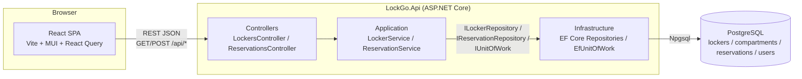

# Architecture

## Overview

LockGo is a two-tier web app: a React SPA talking to a .NET Web API over
HTTP/JSON, backed by PostgreSQL. There's no server-rendering, no message
queue, no cache layer — the feature set (search, view, reserve) doesn't need
one, and the target database is a low-spec free-tier instance where every
extra moving part is one more thing competing for RAM.



## Backend: layered, dependency pointing inward

```
LockGo.Api/            Controllers, Program.cs, DI wiring, error middleware
LockGo.Application/    Services (business rules), DTOs, repository interfaces
LockGo.Domain/         Entities, enums — no dependencies on anything else
LockGo.Infrastructure/ EF Core DbContext, migrations, repository implementations
LockGo.Tests/          xUnit: unit, concurrency, integration
```

`Domain` has zero dependencies. `Application` depends only on `Domain` — it
defines `ILockerRepository`, `IReservationRepository`, `IUnitOfWork` as
interfaces but never touches EF Core or Npgsql directly, so the business
rules in `ReservationService` are testable with plain fakes/mocks instead of
a real database. `Infrastructure` implements those interfaces against
Postgres. `Api` wires everything together and is the only project that knows
about ASP.NET Core.

This split is what makes [`LockGo.Tests/Unit/ReservationServiceTests.cs`](../LockGo.Api/LockGo.Tests/Unit/ReservationServiceTests.cs)
and the concurrency test possible without spinning up a database.

## The concurrency-critical path: `POST /api/reservations`

This is the one part of the system where correctness under concurrent
requests actually matters — business rule 4: no duplicate reservations from
a double-clicked Confirm button. The flow,
all inside one DB transaction (`EfUnitOfWork`):

1. Look up the reservation by `idempotencyKey`. If found, return it —
   this is what makes a resent/duplicated request safe.
2. Load the compartment (tracked, not `AsNoTracking`) and confirm the locker
   is open.
3. Check for an overlapping **active** reservation on that compartment
   against live `Reservation` rows — never the denormalized
   `Compartment.Status` column, which is fast-read-only and can be stale.
4. Insert the reservation, flip `Compartment.Status` to `Occupied`.
5. `SaveChanges` — Postgres enforces two independent safety nets here:
   - a **unique index on `idempotency_key`** catches two requests racing
     past step 1 with the same key (a genuine double-click, not just a
     slow first check) — `EfUnitOfWork` translates that constraint
     violation back into "return the other request's reservation."
   - **`xmin`-based optimistic concurrency** on `Compartment` catches two
     *different* requests racing for the *same compartment/time* — the
     loser's `UPDATE` affects 0 rows, EF raises
     `DbUpdateConcurrencyException`, which `EfUnitOfWork` maps to a 409.

Why optimistic (`xmin`) instead of a pessimistic row lock (`SELECT ... FOR
UPDATE`)? The spec calls for it explicitly given the free-tier server's
limited RAM — a lock held for the duration of a transaction blocks other
connections on a server that can't spare many of them; an optimistic check
only costs something on the rare occasion two writes actually collide.

See [`docs/DEBUGGING.md`](DEBUGGING.md) for a real race condition this
design surfaced (and fixed) during test-writing.

## Availability model

`Compartment.Status` (`Available`/`Occupied`) is denormalized specifically
so `GET /api/lockers` and `GET /api/lockers/{id}` can list/filter without
joining or aggregating `Reservation` rows on every request — it's a plain
indexed column. It is **not** consulted on the write path (see step 3
above); it exists purely to make reads cheap on a low-spec database.

Expiry is lazy: a reservation's `Status` is only ever `Active`, `Completed`,
or `Cancelled` — there's no `Expired` state to keep in sync. Whether a
reservation currently counts as active is always derived:

```csharp
IsActive => Status == ReservationStatus.Active && EndTime > DateTimeOffset.UtcNow;
```

No cron job, no background worker — one less service running on a
resource-constrained box.

## Frontend

```
src/
 ├─ pages/        FindLockerPage, LockerDetailPage, ReservationPage, ConfirmationPage
 ├─ components/   LockerCard, FilterBar, CompartmentSelector, SummaryCard, Layout
 ├─ hooks/        useLockers/useLocker, useCreateReservation/useReservationQuery (React Query)
 ├─ api/          axios client + typed endpoint functions
 ├─ types/        TS types mirroring the backend DTOs
 └─ theme/        MUI theme
```

Locker → compartment selection is passed between `LockerDetailPage` and
`ReservationPage` via router state (no extra round-trip — the data's
already in hand from the detail page fetch). `ConfirmationPage` fetches by
reservation ID instead, so the confirmation URL is shareable/refreshable on
its own.

The idempotency key for a reservation is generated once per visit to the
Reservation page (`useMemo(() => crypto.randomUUID(), [])`) and reused for
every Confirm click, including a resend after a double-click — see
[Business rule 4](DEBUGGING.md).
