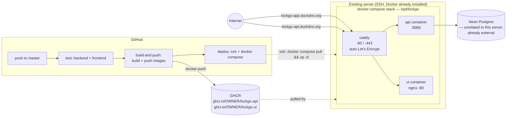

# Deployment

Docker images built and pushed by GitHub Actions, deployed onto an
existing server (not a fresh cloud service) over SSH, reachable from the
internet via two free DuckDNS names in front of a Caddy reverse proxy.

Chosen over Jenkins deliberately — the assessment spec calls this out
explicitly ("Jenkins would need a self-hosted agent, which the free-tier
server can't spare RAM for"), and this server already has that exact
problem: it was running Jenkins for an earlier project. Retiring Jenkins
and using GitHub-hosted runners frees that RAM instead of adding to it.



## Why two DuckDNS names, not one domain with subdomains

DuckDNS's free tier issues one A-record per registered name of the form
`<name>.duckdns.org` — there's no way to provision a true sub-subdomain
under an existing DuckDNS name (no `app.lockgo.duckdns.org` as a separate
DuckDNS-managed record). The practical equivalent — and what "register
another one" gets you on the free tier — is a **second, independent**
DuckDNS name, pointed at the same server IP:

- `lockgo-app.duckdns.org` → frontend (adjust to whatever you actually
  register)
- `lockgo-api.duckdns.org` → backend API

Caddy doesn't care that these aren't "real" subdomains of one root — it
routes purely on the `Host` header, so the `Caddyfile` below works
identically either way. This also matches the app's existing CORS setup,
which already expects the frontend and API to be separate origins
(`AllowedOrigins` in `appsettings.json`).

## Image build notes

- **API image** (`LockGo.Api/Dockerfile`) is environment-agnostic —
  `Database`/`Jwt`/`AllowedOrigins` are read from environment variables at
  **container runtime** (ASP.NET Core's config binder maps
  `Database__Host`, `Jwt__Secret`, etc. onto the same `DatabaseOptions`/
  `JwtOptions` classes already used locally — no code changes). The same
  image works for any environment; only the `.env` passed to it changes.
- **UI image** (`frontend/Dockerfile`) is **not** environment-agnostic —
  Vite bakes `VITE_API_BASE_URL` in at build time, so the image is
  specific to whichever API URL it was built against (currently hardcoded
  in `.github/workflows/ci.yml`'s `build-args` — update it there if the
  API's DuckDNS name changes). Fine for a single deployment target; if a
  second environment (e.g. staging) is ever needed, switch to a
  runtime-config-injection pattern (a small `config.js` written by an
  entrypoint script from env vars, loaded before the app bundle) rather
  than building a separate image per environment.

## One-time server setup

Run once, over SSH, before the first automated deploy:

1. **Retire Jenkins** — `systemctl stop jenkins && systemctl disable jenkins`.
2. **Stage the compose files**:
   ```bash
   mkdir -p /opt/lockgo
   # copy deploy/docker-compose.yml and deploy/Caddyfile from this repo to /opt/lockgo/
   cd /opt/lockgo
   cp .env.example .env   # then edit .env with real values — see below
   ```
3. **Fill in `/opt/lockgo/.env`** (copied from [`deploy/.env.example`](../deploy/.env.example)):
   `GITHUB_REPOSITORY_OWNER` (your GitHub username/org — used to resolve
   the `ghcr.io/...` image names), `Database__*` (same values as your
   `appsettings.Development.json`), `Jwt__Secret` (a real random value —
   **use a different one than local dev**), `AllowedOrigins__0` (your
   frontend's DuckDNS URL).
4. **Edit `/opt/lockgo/Caddyfile`** — replace the two placeholder
   hostnames with your actual registered DuckDNS names.
5. **Point DNS**: in the DuckDNS dashboard, set both names' IP to this
   server's public IP. If the server's IP isn't static, install DuckDNS's
   updater (a cron job hitting their update URL) — out of scope here since
   it depends on whether this server already has one from the prior
   project.
6. **Add GitHub repo secrets** (Settings → Secrets and variables →
   Actions): `DEPLOY_HOST` (server IP or a DuckDNS name pointed at it),
   `DEPLOY_USER` (SSH user), `DEPLOY_SSH_KEY` (private key whose public
   half is in that user's `~/.ssh/authorized_keys`). No GHCR-specific
   secret is needed — the workflow authenticates with the automatically
   provided `GITHUB_TOKEN`.
7. **First run**: `cd /opt/lockgo && docker compose up -d`, then
   `docker compose logs -f caddy` and confirm both certificates issue
   successfully (look for `certificate obtained successfully` per
   hostname). If it fails, the near-always cause is DNS not having
   propagated yet, or port 80/443 not actually reaching this server
   (firewall/security group) — Caddy needs port 80 reachable for the
   HTTP-01 challenge even though the app is eventually served over 443.

After that, every push to `master` that passes tests builds fresh images,
pushes them to GHCR, and redeploys automatically — no further manual
steps.

## Rotating secrets

- **JWT secret**: edit `Jwt__Secret` in `/opt/lockgo/.env`, then
  `docker compose up -d api` (recreates just that container). Every
  previously issued token becomes invalid immediately — expected, this is
  what rotation means.
- **DB password**: change it in Neon (or wherever the DB is hosted) first,
  then update `Database__Password` in `.env`, then `docker compose up -d api`.
- **Deploy SSH key**: generate a new keypair, add the new public key to
  the server's `authorized_keys` *before* removing the old one, update
  `DEPLOY_SSH_KEY` in GitHub repo secrets, then remove the old public key
  from the server.

## Verifying a deploy

```bash
curl https://lockgo-api.duckdns.org/api/lockers      # 200 + JSON
```

Open `https://lockgo-app.duckdns.org` in a browser — if the UI loads but
API calls fail with a CORS error in the console, `AllowedOrigins__0` in
the server's `.env` doesn't match the frontend's actual origin exactly
(scheme + host, no trailing slash).

## What wasn't verified here

Docker Desktop in this environment repeatedly failed to stay up (crashed
back to "pipe not found" after multiple clean restarts — the same
instability hit earlier in this project when trying to verify against a
live Postgres instance), so neither image was actually built locally
before being committed. Both Dockerfiles were reviewed manually, line by
line, against the real project structure instead — path names in every
`COPY` were checked against the actual solution layout
(`LockGo.Api/{LockGo.Api,LockGo.Application,LockGo.Domain,LockGo.Infrastructure}/`),
and the multi-stage build args/env var flow was traced by hand. That's a
real substitute for "does the Dockerfile reference the right paths," but
not for "does `dotnet publish`/`npm run build` actually succeed inside the
container" — **run `docker build -f LockGo.Api/Dockerfile LockGo.Api` and
`docker build frontend` once before relying on the CI pipeline for a real
deploy.**
